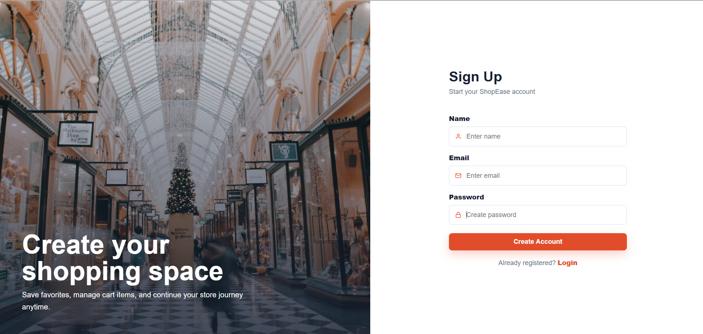
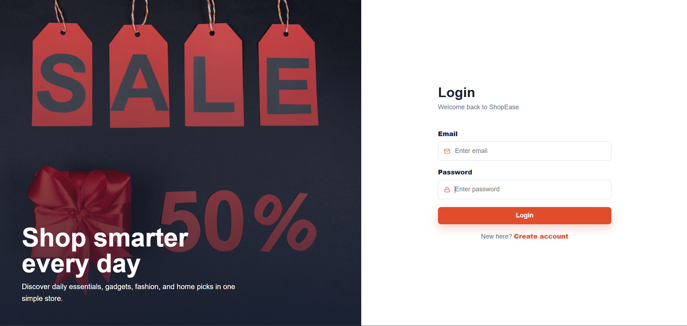
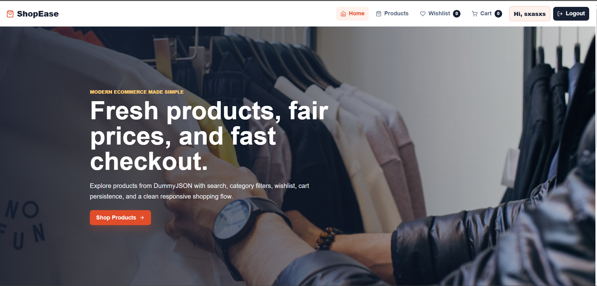
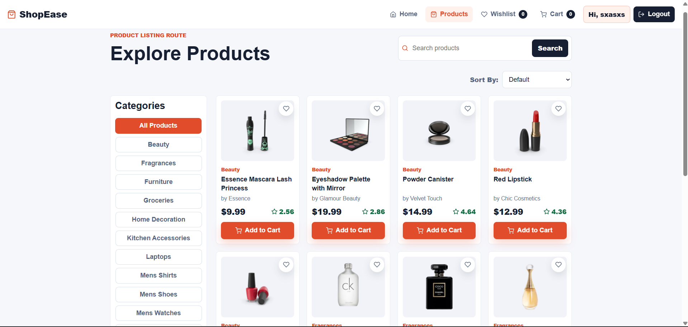
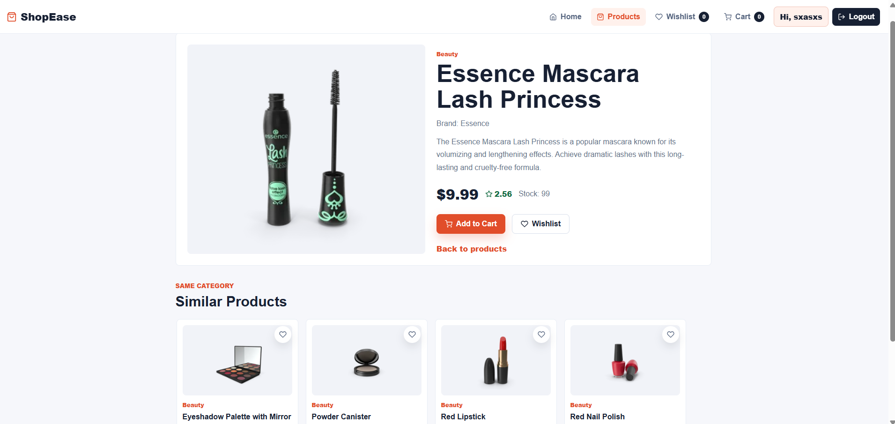
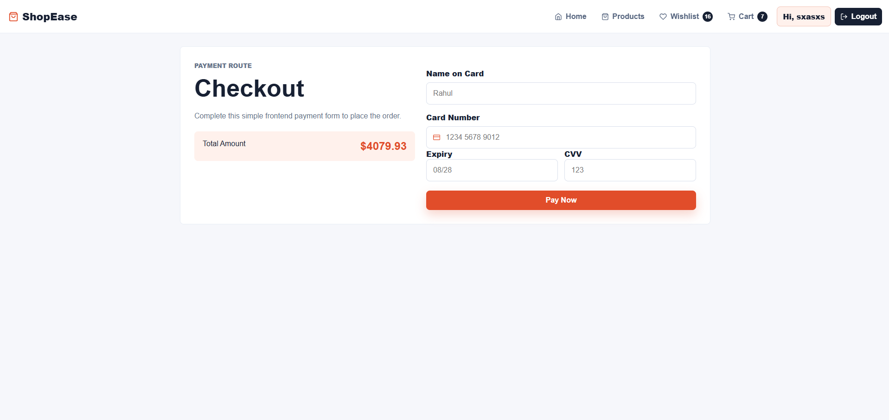
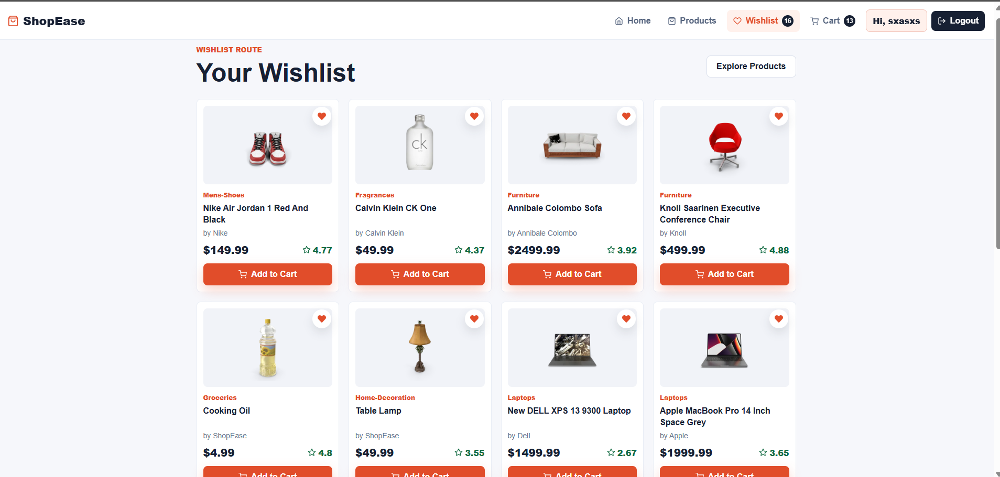
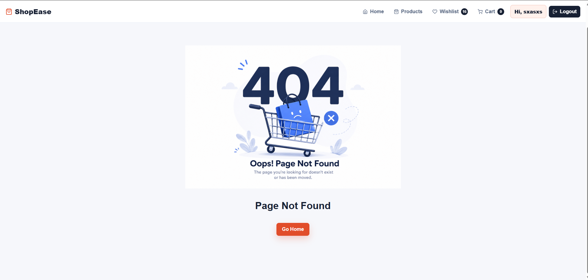

# 🛒 E-Commerce Website — React JS

A modern and responsive **E-Commerce Web Application** built using **React JS**. This project demonstrates frontend development skills including API integration, responsive UI design, state management, reusable components, LocalStorage authentication, and performance optimization.

---

# 🚀 Live Demo

```txt
Add your deployed project link here
```

# 📂 GitHub Repository

```txt
Add your GitHub repository link here
```

---

# ✨ Features

## 🛍️ Core Features

- Product Listing Page
- Product Details Page
- Shopping Cart Functionality
- Wishlist Functionality
- Product Search
- Category Filtering
- Pagination / Load More Products
- Similar Products Section
- Sign Up / Login / Logout
- Protected Routes
- LocalStorage Authentication

---

## 📱 Responsive Design

- Mobile-First Layout
- Responsive Navbar
- Responsive Product Grid
- Responsive Cart Sidebar
- Optimized for Mobile, Tablet, and Desktop
- Flexbox & CSS Grid Layouts

---

## 🎨 UI/UX Features

- Professional E-Commerce UI
- Attractive Product Cards
- Modern Typography
- Consistent Spacing & Alignment
- Hover Effects
- Smooth Page Transitions
- Dark Mode Support
- Loading Skeletons

---

## ⚡ Performance Optimization

- Lazy Loading Images
- Optimized Product Rendering
- Reusable React Components
- Efficient State Management
- Clean Folder Structure

---

# 🛠️ Tech Stack

| Technology         | Usage                        |
| ------------------ | ---------------------------- |
| React JS           | Frontend Framework           |
| React Router DOM   | Routing                      |
| Context API        | State Management             |
| Tailwind CSS / CSS | Styling                      |
| Axios / Fetch API  | API Requests                 |
| Framer Motion      | Animations                   |
| DummyJSON API      | Product Data                 |
| LocalStorage       | Authentication & Persistence |

---

# 🔗 API Endpoints Used

```js
const BASE_URL = "https://dummyjson.com";

// Get All Products
/products

// Get Single Product
/products/:id

// Search Products
/products/search?q=

// Get Categories
/products/categories

// Products By Category
/products/category/:name

// Pagination
/products?limit=&skip=
```

---

# 📸 Screenshots

### 🔐 Login / Signup Page





### 🏠 Home Page



---

### 📄 Product Details Page





---

### 🛒 Cart Page




---

### ❤️ Wishlist Page



### Not Found Page



---

---

# 📂 Folder Structure

```bash
src/
 ├── components/
 ├── pages/
 ├── context/
 ├── services/
 ├── routes/
 ├── assets/
 ├── utils/
 └── App.jsx
```

---

# ⚙️ Installation & Setup

## Clone Repository

```bash
git clone https://github.com/AllemSamyel-03/E-Commerce-Website.git
```

---

## Navigate to Project Folder

```bash
cd E-Commerce
```

---

## Install Dependencies

```bash
npm install
```

---

## Start Development Server

```bash
npm run dev
```

---

# 🌐 Deployment

You can deploy this project using:

- Vercel
- Netlify
- GitHub Pages

---

# 📌 Future Improvements

- Payment Gateway Integration
- Backend Authentication
- Product Reviews & Ratings
- Order Tracking
- Admin Dashboard
- User Profile Management

---

# 👨‍💻 Author

Developed by **ALLEM SAMYEL**

GitHub: https://github.com/AllemSamyel-03

Linkedin: https://www.linkedin.com/in/allem-samyel-039655374/

---

# 📄 License

This project is licensed under the MIT License.
